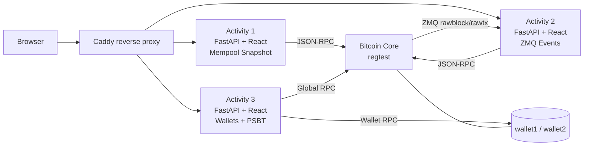

<div align="center">

# CoreCraft

**Bitcoin Core integration through JSON-RPC and ZMQ, delivered as three evolving web applications.**

`Python 3.12` · `FastAPI` · `Uvicorn` · `pyzmq` · `React` · `Vite` · `TypeScript` · `Docker Compose`

[](README.md)
[](README.en-US.md)

[](https://github.com/btcneves/CoreCraft/releases/latest)
[](https://github.com/btcneves/CoreCraft/actions/workflows/ci.yml)
[](https://github.com/btcneves/CoreCraft/pkgs/container/corecraft-suite-atividade-1)

</div>

---

> **Quick start — with Docker:**
>
> ```bash
> git clone https://github.com/btcneves/CoreCraft.git && cd CoreCraft
> ./scripts/quickstart.sh        # Linux / macOS
> docker compose --profile all up
> ```
>
> On Windows PowerShell, use `.\scripts\setup-windows.ps1` instead of `./scripts/quickstart.sh`.
>
> Open the activities at `http://localhost:8001`, `8002`, and `8003`.  
> Full guide, including the non-Docker setup: [**docs/en-US/getting-started.md**](docs/en-US/getting-started.md)

### What you should see after `docker compose --profile all up`

```text
✔ Container corecraft-bitcoind       Healthy
✔ Container corecraft-bitcoin-init   Exited (0)
✔ Container corecraft-suite-atividade-1    Healthy
✔ Container corecraft-suite-atividade-2    Healthy
✔ Container corecraft-suite-atividade-3    Healthy
✔ Container corecraft-caddy          Started
```

| URL | Description |
|-----|-------------|
| `http://localhost:8001` | Activity 1 — Mempool Snapshot (RPC) |
| `http://localhost:8002` | Activity 2 — Real-time ZMQ events |
| `http://localhost:8003` | Activity 3 — Multi-wallet + PSBT |
| `http://localhost/atividade-1/` | Activity 1 through Caddy (reverse proxy) |

Check that everything is working:

```bash
./scripts/smoke-test.sh
# ══════════════════════════════════════
#   CoreCraft — Smoke Tests
# ══════════════════════════════════════
# Activity 1 — Mempool Snapshot (port 8001)
#   ✔  GET /api/mempool/summary  (200)
#   ✔  GET /api/blockchain/lag   (200)
# Activity 2 — ZMQ Events (port 8002)
#   ✔  GET /api/events/summary   (200)
# ...
#   RESULT: 7/7 endpoints OK
```

---

## Overview

CoreCraft contains the three required activities from the CoreCraft program. Each activity is an **independent microservice** with a FastAPI backend and a React frontend. The services communicate with a Bitcoin Core node running in `regtest` and expose interpreted network state through a web interface.

The activities follow a clear progression:

| # | Focus | Data source |
|---|-------|-------------|
| 1 | Smart mempool and node snapshot | RPC only |
| 2 | Real-time events and state-vs-flow divergence | RPC + ZMQ |
| 3 | Multiple wallets, PSBT, and interpreted transaction state | Global RPC + per-wallet RPC |

### High-Level Architecture



Full technical diagrams: [`docs/en-US/architecture.md`](docs/en-US/architecture.md).

---

## Delivery Status

| Activity | Status | Main features |
|----------|--------|---------------|
| [Activity 1](atividade-1/) | Completed and validated | RPC, mempool summary, blockchain lag |
| [Activity 2](atividade-2/) | Completed and validated, requires active ZMQ | rawtx/rawblock, recent events, RPC/ZMQ comparison |
| [Activity 3](atividade-3/) | Completed and validated, requires regtest wallets | multiple wallets, PSBT, interpreted transaction state, wallet status |

Local uvicorn ports: Activity 1 → `8001` · Activity 2 → `8002` · Activity 3 → `8003`.

All three backends follow the same structure: `app/main.py` for FastAPI routes, `app/rpc_client.py` for a dedicated JSON-RPC client, plus domain modules and a React build served by FastAPI.

Every backend exposes `/health`, `/metrics`, and JSON logs with `correlation_id`. CI runs `ruff`, `mypy --strict`, `pytest --cov`, `npm audit`, `pip-audit`, Trivy, and Compose validation.

---

## Key Concepts

| Concept | Where it appears | Summary |
|---------|------------------|---------|
| `regtest` | All activities | Local, controlled Bitcoin Core network. It allows on-demand mining, test wallets, and full validation without touching testnet or mainnet. |
| JSON-RPC | Activities 1, 2, and 3 | Synchronous interface used to query node state, mempool, blockchain, wallets, UTXOs, and to broadcast transactions. |
| ZMQ | Activity 2 | Bitcoin Core asynchronous PUB/SUB channel. It publishes `rawblock` and `rawtx` events in near real time for block and transaction detection. |
| Mempool | Activities 1 and 2 | Set of valid transactions not yet confirmed in a block. Activity 1 interprets RPC snapshots; Activity 2 observes related ZMQ events. |
| UTXO | Activity 3 | Unspent transaction output that can fund a new transaction. The selected wallet needs mature UTXOs before it can send funds. |
| PSBT | Activity 3 | Partially Signed Bitcoin Transaction. The backend uses `walletcreatefundedpsbt → walletprocesspsbt → finalizepsbt → sendrawtransaction` to create, sign, and broadcast transactions with Bitcoin Core. |
| Wallet-scoped RPC | Activity 3 | Calls made under `/wallet/<name>` so balance, UTXO, signing, and history operations stay isolated per wallet. |
| Interpreted state | Activity 3 | Domain layer that translates node responses into states such as `broadcast`, `mempool`, `confirmed`, and `unknown`. |

Deeper references: [`docs/en-US/rpc-zmq.md`](docs/en-US/rpc-zmq.md), [`docs/en-US/architecture.md`](docs/en-US/architecture.md), and [`docs/en-US/setup-bitcoin-core.md`](docs/en-US/setup-bitcoin-core.md).

---

## Repository Structure

```text
CoreCraft/
├── atividade-1/                  RPC mempool snapshot
│   ├── backend/                  FastAPI (port 8001)
│   │   ├── app/
│   │   │   ├── main.py           /api/mempool/summary and /api/blockchain/lag routes
│   │   │   ├── mempool.py        fee-rate and distribution calculations
│   │   │   └── rpc_client.py     JSON-RPC with error handling
│   │   └── requirements.txt
│   ├── frontend/                 React/Vite dashboard with 5s polling
│   ├── .env.example
│   └── README.md
│
├── atividade-2/                  Real-time events through ZMQ
│   ├── backend/                  FastAPI (port 8002)
│   │   ├── app/
│   │   │   ├── main.py           /api/events/{summary,latest,state-comparison} routes
│   │   │   ├── zmq_listener.py   daemon thread subscribing to rawblock + rawtx
│   │   │   ├── event_store.py    deque(maxlen=20) blocks · deque(maxlen=200) txs
│   │   │   ├── event_service.py  aggregators
│   │   │   └── rpc_client.py
│   │   └── requirements.txt
│   ├── frontend/                 React/Vite dashboard with WebSocket + polling fallback
│   ├── .env.example
│   └── README.md
│
├── atividade-3/                  Multi-wallet + PSBT + interpreted state
│   ├── backend/                  FastAPI (port 8003)
│   │   ├── app/
│   │   │   ├── main.py           /wallets, /wallet/{select,status}, /tx/send, /tx/{txid}
│   │   │   ├── wallet_service.py listwalletdir/listwallets/loadwallet/getwalletinfo
│   │   │   ├── tx_service.py     full PSBT flow
│   │   │   ├── tx_interpreter.py broadcast → mempool → confirmed → unknown
│   │   │   └── rpc_client.py     global RPC + per-wallet RPC (/wallet/<name>)
│   │   └── requirements.txt
│   ├── frontend/                 React/Vite: wallet selector, PSBT send flow, tx table
│   ├── .env.example
│   └── README.md
│
├── src/
│   └── corecraft/                shared Python package
│       ├── __init__.py           re-exports all public types
│       └── types.py              38 TypedDicts for RPC responses and domain types
│
├── tests/
│   ├── conftest.py               FakeRPC, FakeResponse, import_activity_module
│   ├── atividade_1/              Activity 1 unit tests
│   ├── atividade_2/              Activity 2 unit tests
│   └── atividade_3/              Activity 3 unit tests
│
├── docs/
│   ├── README.md                 bilingual documentation index
│   ├── pt-BR/                    documentation in Brazilian Portuguese
│   │   ├── getting-started.md
│   │   ├── architecture.md
│   │   ├── setup-bitcoin-core.md
│   │   ├── docker-stack.md
│   │   └── smoke-tests.md
│   ├── en-US/                    documentation in English (US)
│   │   ├── getting-started.md    start here (Docker + manual)
│   │   ├── architecture.md       architecture and technical decisions
│   │   ├── setup-bitcoin-core.md Bitcoin Core setup
│   │   ├── docker-stack.md       Docker stack reference
│   │   └── smoke-tests.md        endpoint validation
│   └── assets/                   screenshots and visual evidence
│
├── CHANGELOG.md                  version history and fixes
├── CONTRIBUTING.md               contribution guide
├── SECURITY.md                   security policy
├── docker-compose.yml            optional stack for all 3 backends
├── LICENSE                       MIT
├── .gitignore
└── README.md
```

---

## Requirements

| Dependency | Minimum version | Notes |
|------------|-----------------|-------|
| Python | 3.11+ (tested on 3.12) | `python3 -m venv` |
| Bitcoin Core | 26.0+ | `regtest` mode with RPC enabled |
| ZMQ | — | Activity 2 only (`zmqpubrawblock` and `zmqpubrawtx` in `bitcoin.conf`) |
| `pip` | up to date | Installs `fastapi`, `uvicorn`, `requests`, `python-dotenv`, `pyzmq` |
| Node.js | 18+ locally, 22.12 in CI/Docker | React/Vite frontends |

Bitcoin Core setup guide: [`docs/en-US/setup-bitcoin-core.md`](docs/en-US/setup-bitcoin-core.md)

---

## Quickstart

### 1. Configure Bitcoin Core once

```bash
# bitcoin.conf — see docs/en-US/setup-bitcoin-core.md for the full content
bitcoind -regtest -daemon
bitcoin-cli -regtest createwallet wallet1
bitcoin-cli -regtest createwallet wallet2
ADDR=$(bitcoin-cli -regtest -rpcwallet=wallet1 getnewaddress)
bitcoin-cli -regtest generatetoaddress 101 $ADDR    # creates mature spendable balance
bitcoin-cli -regtest getzmqnotifications            # should list rawblock and rawtx
```

### 2. Run one activity

Each activity is independent. The flow is the same for all three; only change the number:

```bash
cd atividade-1/backend
cp ../.env.example .env                              # adjust RPC credentials
python3 -m venv .venv && source .venv/bin/activate
pip install -r requirements.txt
uvicorn app.main:app --host 0.0.0.0 --port 8001 --reload
```

The frontend is available at `http://localhost:8001`, served by the FastAPI app itself.

### 3. Run the full stack with Docker Compose

```bash
cp .env.example .env
docker compose --profile all up --build
# Caddy:
#   http://localhost/atividade-1/
#   http://localhost/atividade-2/
#   http://localhost/atividade-3/
# Direct ports:
#   http://localhost:8001
#   http://localhost:8002
#   http://localhost:8003
```

Expected signals once the stack is ready:

```text
corecraft-bitcoind             | Bitcoin Core starting
corecraft-bitcoin-init         | Initial funding complete
corecraft-suite-atividade-1    | INFO: Application startup complete.
corecraft-suite-atividade-2    | INFO: Application startup complete.
corecraft-suite-atividade-3    | INFO: Application startup complete.
corecraft-caddy                | serving initial configuration
```

Compose starts `bitcoind` in regtest mode, initializes wallets, mines initial funds to `wallet1`, runs all three backends, and exposes the interfaces through Caddy. Details: [`docs/en-US/docker-stack.md`](docs/en-US/docker-stack.md).

Main variables:

```bash
BTC_RPC_USER=user
BTC_RPC_PASSWORD=password
BTC_RPC_AUTH=user:corecraft$55eef9f3661634839386ead63a2e72d60d0ef27470547ec7b4b12d0e9dce8db2
LOG_LEVEL=INFO
```

`BTC_RPC_AUTH` is the `rpcauth` value used by Bitcoin Core. `BTC_RPC_USER` and `BTC_RPC_PASSWORD` are still used by `bitcoin-cli`, `bitcoin-init`, and the backends to authenticate through HTTP Basic Auth.

---

## Endpoints

| Method | Route | Activity | Description |
|:------:|-------|:--------:|-------------|
| GET | `/api/mempool/summary` | 1 | Mempool snapshot with fee-rate distribution |
| GET | `/api/blockchain/lag` | 1 | Sync lag (`headers - blocks`) |
| GET | `/health` | 1-3 | Simple backend healthcheck |
| GET | `/metrics` | 1-3 | Basic Prometheus text metrics |
| GET | `/api/events/summary` | 2 | Counters and event rate from the ZMQ buffer |
| GET | `/api/events/latest` | 2 | Latest blocks and txs received through ZMQ |
| GET | `/api/events/state-comparison` | 2 | Compares `getbestblockhash` (RPC) with latest block (ZMQ) |
| GET | `/wallets` | 3 | Lists available, loaded, and selected wallets |
| POST | `/wallet/select` | 3 | Selects and loads the active wallet |
| GET | `/wallet/status` | 3 | Balance and UTXOs for the active wallet |
| POST | `/tx/send` | 3 | Creates, signs, and broadcasts a tx through PSBT |
| GET | `/tx/{txid}` | 3 | Interpreted transaction state |

Full smoke tests with `curl`: [`docs/en-US/smoke-tests.md`](docs/en-US/smoke-tests.md).

---

## Documentation

| Document | Contents |
|----------|----------|
| [`docs/en-US/architecture.md`](docs/en-US/architecture.md) | Design decisions, implementation patterns, and trade-offs |
| [`docs/en-US/setup-bitcoin-core.md`](docs/en-US/setup-bitcoin-core.md) | `bitcoin.conf`, regtest, wallets, ZMQ, funds generation |
| [`docs/en-US/rpc-zmq.md`](docs/en-US/rpc-zmq.md) | Pull (RPC) vs push (ZMQ) concepts and rationale per activity |
| [`docs/en-US/deploy-vps.md`](docs/en-US/deploy-vps.md) | Ubuntu 22.04 VPS deployment with `tmux` and `ufw` |
| [`docs/en-US/deploy-cloudflare-tunnel.md`](docs/en-US/deploy-cloudflare-tunnel.md) | Public exposure through Cloudflare Tunnel or ngrok |
| [`docs/en-US/smoke-tests.md`](docs/en-US/smoke-tests.md) | Activity-specific `curl` smoke tests |
| [`docs/en-US/docker-stack.md`](docs/en-US/docker-stack.md) | Full Docker stack, variables, and Make commands |
| [`docs/en-US/docker-troubleshooting.md`](docs/en-US/docker-troubleshooting.md) | RPC auth, healthcheck, ZMQ, and Caddy diagnostics |
| [`docs/en-US/live-validation.md`](docs/en-US/live-validation.md) | Full validation output against Bitcoin Core v31.0 |
| [`docs/en-US/public-demo.md`](docs/en-US/public-demo.md) | Public demo evidence through Cloudflare Tunnel (2026-05-03) |

Automated deployment: [`.github/workflows/deploy.yml`](.github/workflows/deploy.yml) runs manual deployments to VPS or VPS + Cloudflare Tunnel using GitHub Secrets.

Each activity has its own detailed README:

- [`atividade-1/README.md`](atividade-1/README.md) — goal, constraints, endpoints, examples
- [`atividade-2/README.md`](atividade-2/README.md) — `event → state` flow, ZMQ, divergence
- [`atividade-3/README.md`](atividade-3/README.md) — multi-wallet, PSBT, tx interpretation

---

## Tests

The project uses **pytest** with a minimum coverage threshold of 70% and currently has 85% coverage.

```bash
# install development dependencies
pip install -e ".[dev]"

# run the full suite with coverage
pytest tests/ --cov

# strict type checking for the 3 activities
python -m mypy --config-file mypy-atividade-1.ini atividade-1/backend/app/
python -m mypy --config-file mypy-atividade-2.ini atividade-2/backend/app/
python -m mypy --config-file mypy-atividade-3.ini atividade-3/backend/app/
```

Expected output:

```text
pytest: tests passed, coverage >= 70%
mypy: Success: no issues found
```

| Covered module | Coverage |
|---|---|
| `rpc_client.py` (3 activities) | 95–96% |
| `zmq_listener.py` | 84% |
| `tx_service.py` / `tx_interpreter.py` | 96–98% |
| `event_service.py` | 100% |
| **Total** | **85%** |

Tests use `monkeypatch` to isolate each domain module. `FakeRPC` simulates the Bitcoin RPC client without real network access. `import_activity_module` ensures each activity is imported in a clean namespace.

---

## Design Decisions

- **No high-level Bitcoin libraries.** Each activity has its own `rpc_client.py` using `requests` + `HTTPBasicAuth`. Block hashes are calculated locally in Python.
- **No database.** State lives in memory (`deque` in Activity 2, `dict` in Activity 3). Restarting the process clears state by design.
- **PSBT in Activity 3.** The flow is `walletcreatefundedpsbt → walletprocesspsbt → finalizepsbt → sendrawtransaction`, letting Bitcoin Core handle UTXO selection and fees.
- **Structured 503 errors.** When the node is offline, all routes that depend on it return `{"detail": {"error": "node_unavailable", "detail": "..."}}` with HTTP 503.
- **Minimal observability.** Logs are emitted as JSON with `service` and `correlation_id`; every backend exposes `/health` and `/metrics`.
- **Isolated frontends.** Each activity has its own React/Vite/TypeScript frontend. Relative URLs and Caddy prefixes allow direct access (`:8001`/`:8002`/`:8003`) or access through `/atividade-N/`.
- Full architecture decisions are documented in [`docs/en-US/architecture.md`](docs/en-US/architecture.md).

---

## Known Limitations

- The Bitcoin Core node (`bitcoind -regtest`) must be running for any data route to respond. Otherwise, those routes return structured **HTTP 503** errors.
- Activity 2 only receives events if `zmqpubrawblock` and `zmqpubrawtx` are active in `bitcoin.conf`. Without ZMQ enabled, the listener connects but receives nothing. Verify with `bitcoin-cli -regtest getzmqnotifications`.
- Activity 3 can only send transactions if the selected wallet has mature UTXOs. On a fresh regtest network, mine at least 101 blocks before funds are spendable.
- All three applications keep state **in memory**. Restarting uvicorn clears the ZMQ buffer and the list of sent transactions, although txids remain queryable through the node RPC.
- Activity 2 calculates `tx_per_second` over the internal buffer window (`deque(maxlen=200)`), so the value may underestimate the real rate on very active networks.
- Activity 2 resolves txids through RPC `decoderawtransaction`. If the node is offline, ZMQ txs arrive but the txid is not recorded and a warning is logged.

---

## External Access

To make any of the three activities available on the internet:

```bash
# Cloudflare Tunnel, without exposing router ports
cloudflared tunnel --url http://localhost:8001
cloudflared tunnel --url http://localhost:8002
cloudflared tunnel --url http://localhost:8003

# Alternative: ngrok
ngrok http 8001
```

Details for installation, permanent VPS deployment, and firewall setup: [`docs/en-US/deploy-cloudflare-tunnel.md`](docs/en-US/deploy-cloudflare-tunnel.md) and [`docs/en-US/deploy-vps.md`](docs/en-US/deploy-vps.md).

---

## Validation And Demo

The project was validated live against Bitcoin Core v31.0 in `regtest` on 2026-05-02. The complete validation, including real endpoint outputs, the PSBT cycle, and the 503 error path, is documented in [`docs/en-US/live-validation.md`](docs/en-US/live-validation.md).

To reproduce locally, with `bitcoind -regtest` on the default ports:

```bash
./scripts/smoke-test.sh
```

Public demo run on 2026-05-03 through Cloudflare Tunnel:

### Dashboard Screenshots

Versioned placeholders for visual evidence live in [`docs/assets/README.md`](docs/assets/README.md). When generating new screenshots/GIFs for the React dashboards, save them as:

- `docs/assets/activity-1-dashboard.png`
- `docs/assets/activity-2-events.png`
- `docs/assets/activity-3-wallet.png`

| Activity | URL | Validated endpoint | Response |
|----------|-----|--------------------|----------|
| 1 | https://administrators-humanitarian-define-author.trycloudflare.com | `/api/blockchain/lag` | `{"blocks":215,"headers":215,"lag":0}` |
| 2 | https://dice-garcia-hub-particular.trycloudflare.com | `/api/events/summary` | `{"blocks_observed":1,"tx_observed":4,...}` |
| 3 | https://move-after-salaries-kde.trycloudflare.com | `/wallets` | `{"available_wallets":[...],"selected_wallet":"wallet1"}` |

> Temporary `trycloudflare.com` URLs, active while the `cloudflared` processes were running. Full evidence: [`docs/en-US/public-demo.md`](docs/en-US/public-demo.md).

---

## Releases

The release badge uses `shields.io/github/v/release/btcneves/CoreCraft` with SemVer sorting. To avoid `release: invalid`, publish GitHub releases with a clean, valid tag such as `v1.0.0`; do not use text like `CoreCraft v1.0.0` as the tag name. If needed, keep `CoreCraft v1.0.0` only as the GitHub release title.

---

## License

[MIT](LICENSE) © 2026 Pedro Neves
