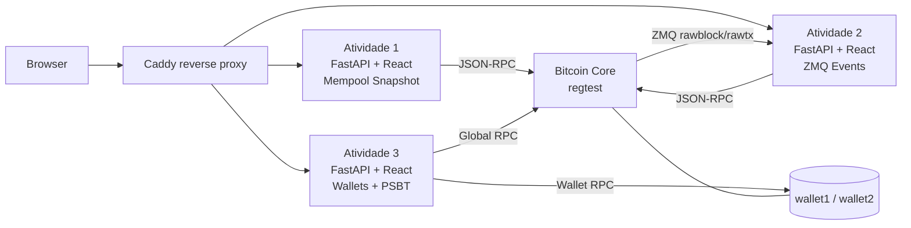

<div align="center">

# CoreCraft

**Integração com Bitcoin Core via JSON-RPC e ZMQ — três aplicações web evolutivas.**

`Python 3.12` · `FastAPI` · `Uvicorn` · `pyzmq` · `React` · `Vite` · `TypeScript` · `Docker Compose`

[](README.md)
[](README.en-US.md)

[](https://github.com/btcneves/CoreCraft/releases/latest)
[](https://github.com/btcneves/CoreCraft/actions/workflows/ci.yml)
[](https://github.com/btcneves/CoreCraft/pkgs/container/corecraft-suite-atividade-1)

</div>

---

> **Início rápido — tem Docker? São três comandos:**
>
> ```bash
> git clone https://github.com/btcneves/CoreCraft.git && cd corecraft
> ./scripts/quickstart.sh        # Linux / macOS  |  scripts\setup-windows.bat no Windows
> docker compose up
> ```
>
> Acede às atividades em `http://localhost:8001`, `8002` e `8003`.  
> Guia completo (incluindo sem Docker): [**docs/getting-started.md**](docs/getting-started.md)

### O que você verá após `docker compose up`

```
✔ Container corecraft-bitcoind       Healthy
✔ Container corecraft-bitcoin-init   Exited (0)
✔ Container corecraft-suite-atividade-1    Healthy
✔ Container corecraft-suite-atividade-2    Healthy
✔ Container corecraft-suite-atividade-3    Healthy
✔ Container corecraft-caddy          Started
```

| URL | Descrição |
|-----|-----------|
| `http://localhost:8001` | Atividade 1 — Mempool Snapshot (RPC) |
| `http://localhost:8002` | Atividade 2 — Eventos ZMQ em tempo real |
| `http://localhost:8003` | Atividade 3 — Multi-wallet + PSBT |
| `http://localhost/atividade-1/` | Atividade 1 via Caddy (proxy reverso) |

Verificar que tudo funciona:

```bash
./scripts/smoke-test.sh
# ══════════════════════════════════════
#   CoreCraft — Smoke Tests
# ══════════════════════════════════════
# Atividade 1 — Mempool Snapshot (porta 8001)
#   ✔  GET /api/mempool/summary  (200)
#   ✔  GET /api/blockchain/lag   (200)
# Atividade 2 — Eventos ZMQ (porta 8002)
#   ✔  GET /api/events/summary   (200)
# ...
#   RESULTADO: 7/7 endpoints OK
```

---

## Visão geral

CoreCraft é o repositório das três atividades obrigatórias do programa CoreCraft. Cada atividade é um **micro-serviço independente** (backend FastAPI + frontend React) que se comunica com um nó Bitcoin Core em `regtest` e expõe uma camada interpretada do estado da rede.

A evolução entre as atividades segue um arco claro:

| # | Foco | Origem dos dados |
|---|------|------------------|
| 1 | Snapshot inteligente da mempool e do nó | Apenas RPC |
| 2 | Eventos em tempo real e divergência estado×fluxo | RPC + ZMQ |
| 3 | Múltiplas wallets, PSBT e estado interpretado de transações | RPC global + RPC por wallet |

### Arquitetura em alto nível



Diagramas técnicos completos: [`docs/architecture.md`](docs/architecture.md).

---

## Status da entrega

| Atividade | Status | Principais recursos |
|-----------|--------|---------------------|
| [Atividade 1](atividade-1/) | Concluída e validada | RPC, mempool summary, blockchain lag |
| [Atividade 2](atividade-2/) | Concluída e validada, requer ZMQ ativo | rawtx/rawblock, eventos recentes, comparação RPC/ZMQ |
| [Atividade 3](atividade-3/) | Concluída e validada, requer wallets em regtest | múltiplas wallets, PSBT, tx interpretada, wallet status |

Portas locais (uvicorn): Atividade 1 → `8001` · Atividade 2 → `8002` · Atividade 3 → `8003`.

Os três backends seguem o mesmo padrão estrutural: `app/main.py` (rotas FastAPI) + `app/rpc_client.py` (cliente JSON-RPC dedicado) + módulos de domínio + build React servido pelo próprio FastAPI.

Todos os backends expõem `/health`, `/metrics` e logs JSON com `correlation_id`. O CI executa `ruff`, `mypy --strict`, `pytest --cov`, `npm audit`, `pip-audit`, Trivy e validação do Compose.

---

## Estrutura do repositório

```
corecraft/
├── atividade-1/                  Snapshot da mempool via RPC
│   ├── backend/                  FastAPI (porta 8001)
│   │   ├── app/
│   │   │   ├── main.py           rotas /api/mempool/summary, /api/blockchain/lag
│   │   │   ├── mempool.py        cálculo de fee rate e distribuição
│   │   │   └── rpc_client.py     JSON-RPC com tratamento de erro
│   │   └── requirements.txt
│   ├── frontend/                 dashboard React/Vite polling 5s
│   ├── .env.example
│   └── README.md
│
├── atividade-2/                  Eventos em tempo real via ZMQ
│   ├── backend/                  FastAPI (porta 8002)
│   │   ├── app/
│   │   │   ├── main.py           rotas /api/events/{summary,latest,state-comparison}
│   │   │   ├── zmq_listener.py   thread daemon assina rawblock + rawtx
│   │   │   ├── event_store.py    deque(maxlen=20) blocos · deque(maxlen=200) txs
│   │   │   ├── event_service.py  agregadores
│   │   │   └── rpc_client.py
│   │   └── requirements.txt
│   ├── frontend/                 dashboard React/Vite com WebSocket + fallback polling
│   ├── .env.example
│   └── README.md
│
├── atividade-3/                  Multi-wallet + PSBT + estado interpretado
│   ├── backend/                  FastAPI (porta 8003)
│   │   ├── app/
│   │   │   ├── main.py           rotas /wallets, /wallet/{select,status}, /tx/send, /tx/{txid}
│   │   │   ├── wallet_service.py listwalletdir/listwallets/loadwallet/getwalletinfo
│   │   │   ├── tx_service.py     fluxo PSBT completo
│   │   │   ├── tx_interpreter.py broadcast → mempool → confirmed → unknown
│   │   │   └── rpc_client.py     RPC global + RPC por wallet (/wallet/<nome>)
│   │   └── requirements.txt
│   ├── frontend/                 React/Vite: seletor de wallet, envio PSBT, tabela de tx
│   ├── .env.example
│   └── README.md
│
├── src/
│   └── corecraft/                pacote Python partilhado
│       ├── __init__.py           re-exporta todos os tipos públicos
│       └── types.py              38 TypedDicts — respostas RPC e tipos de domínio
│
├── tests/
│   ├── conftest.py               FakeRPC, FakeResponse, import_activity_module
│   ├── atividade_1/              testes unitários da Atividade 1
│   ├── atividade_2/              testes unitários da Atividade 2
│   └── atividade_3/              testes unitários da Atividade 3
│
├── docs/
│   ├── getting-started.md        ← começa aqui (Docker + manual, todos os OS)
│   ├── setup-bitcoin-core.md     instalação e configuração do Bitcoin Core
│   ├── docker-stack.md           referência completa da stack Docker
│   ├── architecture.md           decisões de design e trade-offs
│   ├── rpc-zmq.md                conceitos RPC vs ZMQ
│   ├── smoke-tests.md            como verificar os endpoints manualmente
│   ├── deploy-vps.md             deploy em Ubuntu 22.04
│   └── deploy-cloudflare-tunnel.md  exposição pública via Cloudflare
│
├── CHANGELOG.md                  histórico de versões e correções
├── CONTRIBUTING.md               guia de contribuição
├── SECURITY.md                   política de segurança
├── docker-compose.yml            (opcional) sobe os 3 backends
├── LICENSE                       MIT
├── .gitignore
└── README.md
```

---

## Pré-requisitos

| Dependência | Versão mínima | Observação |
|-------------|---------------|------------|
| Python | 3.11+ (testado em 3.12) | `python3 -m venv` |
| Bitcoin Core | 26.0+ | Modo `regtest`, com RPC habilitado |
| ZMQ | — | Apenas Atividade 2 (`zmqpubrawblock` e `zmqpubrawtx` no `bitcoin.conf`) |
| `pip` | atualizado | Instala `fastapi`, `uvicorn`, `requests`, `python-dotenv`, `pyzmq` |
| Node.js | 18+ local, 22.12 no CI/Docker | Frontends React/Vite |

> Setup completo do Bitcoin Core: [`docs/setup-bitcoin-core.md`](docs/setup-bitcoin-core.md)

---

## Quickstart

### 1. Configurar o Bitcoin Core (uma única vez)

```bash
# bitcoin.conf — ver docs/setup-bitcoin-core.md para o conteúdo completo
bitcoind -regtest -daemon
bitcoin-cli -regtest createwallet wallet1
bitcoin-cli -regtest createwallet wallet2
ADDR=$(bitcoin-cli -regtest -rpcwallet=wallet1 getnewaddress)
bitcoin-cli -regtest generatetoaddress 101 $ADDR    # gera saldo maturado
bitcoin-cli -regtest getzmqnotifications            # deve listar rawblock e rawtx
```

### 2. Rodar uma atividade

Cada atividade é independente. O fluxo é o mesmo nas três (apenas troque o número):

```bash
cd atividade-1/backend
cp ../.env.example .env                              # ajuste credenciais RPC
python3 -m venv .venv && source .venv/bin/activate
pip install -r requirements.txt
uvicorn app.main:app --host 0.0.0.0 --port 8001 --reload
```

Frontend disponível em `http://localhost:8001` (servido pelo próprio FastAPI).

### 3. Rodar a stack completa (Docker Compose)

```bash
cp .env.example .env
docker compose up --build
# Caddy:
#   http://localhost/atividade-1/
#   http://localhost/atividade-2/
#   http://localhost/atividade-3/
# Portas diretas:
#   http://localhost:8001
#   http://localhost:8002
#   http://localhost:8003
```

Sinais esperados quando a stack estiver pronta:

```text
corecraft-bitcoind             | Bitcoin Core starting
corecraft-bitcoin-init         | Initial funding complete
corecraft-suite-atividade-1    | INFO: Application startup complete.
corecraft-suite-atividade-2    | INFO: Application startup complete.
corecraft-suite-atividade-3    | INFO: Application startup complete.
corecraft-caddy                | serving initial configuration
```

O Compose sobe `bitcoind` em regtest, inicializa wallets, minera saldo inicial para `wallet1`, executa os tres backends e expõe as interfaces pelo Caddy. Detalhes em [`docs/docker-stack.md`](docs/docker-stack.md).

Variáveis principais:

```bash
BTC_RPC_USER=user
BTC_RPC_PASSWORD=password
BTC_RPC_AUTH=user:corecraft$55eef9f3661634839386ead63a2e72d60d0ef27470547ec7b4b12d0e9dce8db2
LOG_LEVEL=INFO
```

`BTC_RPC_AUTH` é o valor `rpcauth` usado pelo Bitcoin Core. `BTC_RPC_USER` e `BTC_RPC_PASSWORD` continuam sendo usados por `bitcoin-cli`, `bitcoin-init` e pelos backends para autenticar via HTTP Basic Auth.

---

## Endpoints (resumo)

| Método | Rota | Atividade | Descrição |
|:------:|------|:---------:|-----------|
| GET | `/api/mempool/summary` | 1 | Snapshot da mempool com distribuição de fee rate |
| GET | `/api/blockchain/lag` | 1 | Lag de sincronização (`headers - blocks`) |
| GET | `/health` | 1-3 | Healthcheck simples do backend |
| GET | `/metrics` | 1-3 | Métricas Prometheus text básicas |
| GET | `/api/events/summary` | 2 | Contadores e taxa de eventos do buffer ZMQ |
| GET | `/api/events/latest` | 2 | Últimos blocos e txs recebidos via ZMQ |
| GET | `/api/events/state-comparison` | 2 | Compara `getbestblockhash` (RPC) × último bloco (ZMQ) |
| GET | `/wallets` | 3 | Lista wallets disponíveis, carregadas e selecionada |
| POST | `/wallet/select` | 3 | Seleciona e carrega wallet ativa |
| GET | `/wallet/status` | 3 | Saldo e UTXOs da wallet ativa |
| POST | `/tx/send` | 3 | Cria, assina e transmite tx via PSBT |
| GET | `/tx/{txid}` | 3 | Estado interpretado da transação |

Smoke tests completos com `curl`: [`docs/smoke-tests.md`](docs/smoke-tests.md).

---

## Documentação

| Documento | Conteúdo |
|-----------|----------|
| [`docs/architecture.md`](docs/architecture.md) | Decisões de design, padrões de implementação e trade-offs |
| [`docs/setup-bitcoin-core.md`](docs/setup-bitcoin-core.md) | `bitcoin.conf`, regtest, wallets, ZMQ, geração de saldo |
| [`docs/rpc-zmq.md`](docs/rpc-zmq.md) | Conceitos: pull (RPC) vs push (ZMQ) e justificativa por atividade |
| [`docs/deploy-vps.md`](docs/deploy-vps.md) | Deploy em VPS Ubuntu 22.04 com `tmux` e `ufw` |
| [`docs/deploy-cloudflare-tunnel.md`](docs/deploy-cloudflare-tunnel.md) | Exposição pública via Cloudflare Tunnel ou ngrok |
| [`docs/smoke-tests.md`](docs/smoke-tests.md) | Smoke tests `curl` por atividade |
| [`docs/docker-stack.md`](docs/docker-stack.md) | Stack Docker completa, variáveis e comandos Make |
| [`docs/docker-troubleshooting.md`](docs/docker-troubleshooting.md) | Diagnóstico de RPC auth, healthchecks, ZMQ e Caddy |
| [`docs/validacao-ao-vivo.md`](docs/validacao-ao-vivo.md) | Saída completa de validação contra Bitcoin Core v31.0 |
| [`docs/demo-publica.md`](docs/demo-publica.md) | Evidências de demo pública via Cloudflare Tunnel (2026-05-03) |

Cada atividade tem seu próprio README detalhado:

- [`atividade-1/README.md`](atividade-1/README.md) — objetivo, restrições, endpoints, exemplos
- [`atividade-2/README.md`](atividade-2/README.md) — fluxo `evento → estado`, ZMQ, divergência
- [`atividade-3/README.md`](atividade-3/README.md) — multi-wallet, PSBT, interpretação de tx

---

## Testes

O projeto usa **pytest** com cobertura mínima de 70% (actualmente 85%).

```bash
# instalar dependências de desenvolvimento
pip install -e ".[dev]"

# executar suite completa com cobertura
pytest tests/ --cov

# type-checking estrito nas 3 atividades
python -m mypy --config-file mypy-atividade-1.ini atividade-1/backend/app/
python -m mypy --config-file mypy-atividade-2.ini atividade-2/backend/app/
python -m mypy --config-file mypy-atividade-3.ini atividade-3/backend/app/
```

Saídas esperadas:

```text
pytest: tests passed, coverage >= 70%
mypy: Success: no issues found
```

| Módulo coberto | Cobertura |
|---|---|
| `rpc_client.py` (3 atividades) | 95–96% |
| `zmq_listener.py` | 84% |
| `tx_service.py` / `tx_interpreter.py` | 96–98% |
| `event_service.py` | 100% |
| **Total** | **85%** |

Os testes usam `monkeypatch` para isolar cada módulo de domínio. `FakeRPC` simula o cliente Bitcoin RPC sem rede real. `import_activity_module` garante que cada atividade é importada num namespace limpo.

---

## Decisões de design (resumo)

- **Sem libs Bitcoin de alto nível.** Cada atividade tem seu `rpc_client.py` próprio (`requests` + `HTTPBasicAuth`). Hash de bloco é calculado localmente em Python.
- **Sem banco de dados.** Estado em memória (`deque` na Atividade 2, `dict` na Atividade 3). Estado zera ao reiniciar — comportamento esperado.
- **PSBT na Atividade 3.** Fluxo `walletcreatefundedpsbt → walletprocesspsbt → finalizepsbt → sendrawtransaction` para o Core cuidar de seleção de UTXO e fee.
- **Erro 503 estruturado.** Quando o nó está offline, todas as rotas que dependem dele retornam `{"detail": {"error": "node_unavailable", "detail": "..."}}` com HTTP 503.
- **Observabilidade mínima.** Logs são emitidos em JSON com `service` e `correlation_id`; cada backend expõe `/health` e `/metrics`.
- **Frontend isolado.** Cada atividade tem frontend React/Vite/TypeScript próprio. URLs relativas e Caddy com prefixos permitem acesso direto (`:8001`/`:8002`/`:8003`) ou por `/atividade-N/`.
- **Decisões de arquitetura completas em [`docs/architecture.md`](docs/architecture.md).**

---

## Limitações conhecidas

- O nó Bitcoin Core (`bitcoind -regtest`) precisa estar rodando para qualquer rota retornar dados — caso contrário, todas devolvem **HTTP 503** estruturado.
- A Atividade 2 só recebe eventos se `zmqpubrawblock` e `zmqpubrawtx` estiverem ativos no `bitcoin.conf`. Sem ZMQ habilitado, o listener conecta mas não recebe nada (verificar com `bitcoin-cli -regtest getzmqnotifications`).
- A Atividade 3 só envia transações se a wallet selecionada tiver UTXOs maduros. Em regtest novo, é necessário minerar pelo menos 101 blocos para a wallet receber saldo gastável.
- O estado das três aplicações é **em memória**. Reiniciar o uvicorn zera o buffer ZMQ e a lista de transações enviadas (txid permanece consultável via RPC do nó).
- A taxa `tx_per_second` da Atividade 2 é calculada sobre a janela do buffer interno (`deque(maxlen=200)`); em redes muito ativas pode subestimar a taxa real.
- O txid da Atividade 2 é resolvido via RPC `decoderawtransaction` — se o nó estiver offline, txs ZMQ chegam mas o txid não é registrado (loga warning).

---

## Acesso externo

Para tornar qualquer das três atividades acessível pela internet:

```bash
# Cloudflare Tunnel (sem expor portas no roteador)
cloudflared tunnel --url http://localhost:8001
cloudflared tunnel --url http://localhost:8002
cloudflared tunnel --url http://localhost:8003

# Alternativa: ngrok
ngrok http 8001
```

Detalhes (instalação, deploy permanente em VPS, firewall): [`docs/deploy-cloudflare-tunnel.md`](docs/deploy-cloudflare-tunnel.md) e [`docs/deploy-vps.md`](docs/deploy-vps.md).

---

## Validação e demonstração

O projeto foi validado ao vivo contra Bitcoin Core v31.0 em `regtest` em 2026-05-02. A validação completa — incluindo saídas reais dos endpoints, ciclo PSBT e caminho de erro 503 — está documentada em [`docs/validacao-ao-vivo.md`](docs/validacao-ao-vivo.md).

Para reproduzir localmente (requer `bitcoind -regtest` nas portas padrão):

```bash
./scripts/smoke-test.sh
```

Demo pública executada em 2026-05-03 via Cloudflare Tunnel:

### Screenshots dos dashboards

Placeholders versionados para evidências visuais estão em [`docs/assets/README.md`](docs/assets/README.md). Ao gerar novos screenshots/GIFs dos dashboards React, salve-os como:

- `docs/assets/atividade-1-dashboard.png`
- `docs/assets/atividade-2-dashboard.gif`
- `docs/assets/atividade-3-dashboard.png`

| Atividade | URL | Endpoint validado | Resposta |
|-----------|-----|-------------------|----------|
| 1 | https://administrators-humanitarian-define-author.trycloudflare.com | `/api/blockchain/lag` | `{"blocks":215,"headers":215,"lag":0}` |
| 2 | https://dice-garcia-hub-particular.trycloudflare.com | `/api/events/summary` | `{"blocks_observed":1,"tx_observed":4,...}` |
| 3 | https://move-after-salaries-kde.trycloudflare.com | `/wallets` | `{"available_wallets":[...],"selected_wallet":"wallet1"}` |

> URLs temporárias (trycloudflare.com) — ativas enquanto os processos `cloudflared` estavam rodando. Evidências completas: [`docs/demo-publica.md`](docs/demo-publica.md).

---

## Licença

[MIT](LICENSE) © 2026 Pedro Neves
