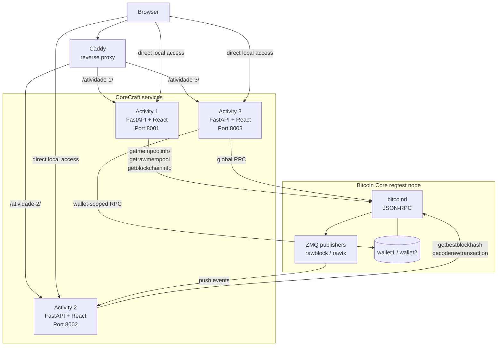
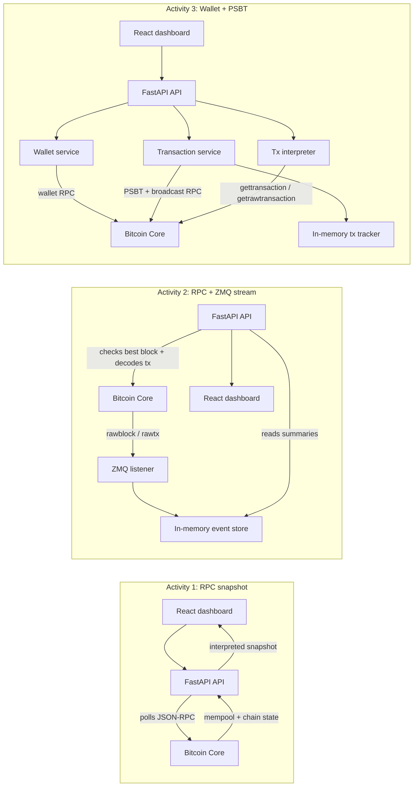
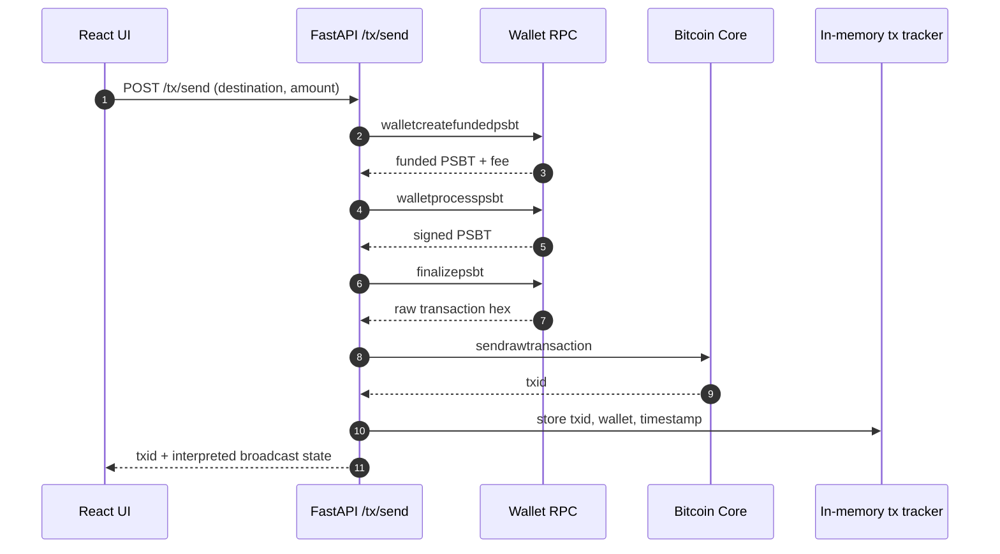
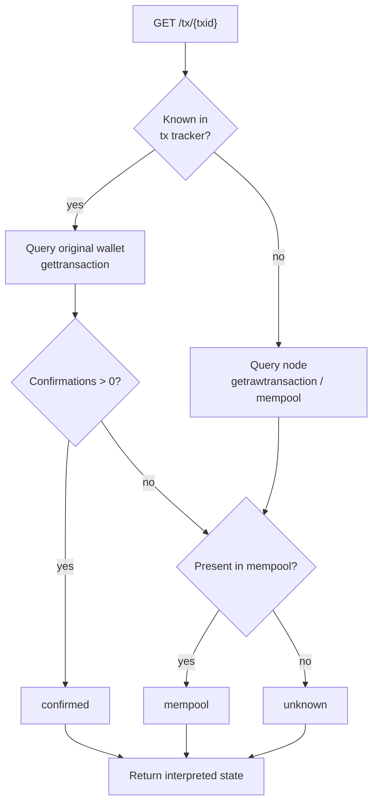

# Architecture

## Stack

| Layer | Technology |
|-------|-----------|
| Backend | Python 3.12 + FastAPI + Uvicorn |
| Frontend | React + Vite + TypeScript |
| Bitcoin Core integration | Custom `rpc_client.py` per activity using `requests` + `HTTPBasicAuth` |
| Event stream | `pyzmq` daemon thread (Activity 2 only) |
| Local orchestration | Docker Compose + Caddy + Bitcoin Core regtest |

## Service overview

Each activity is an independent microservice with its own backend and frontend.

| Activity | Port | Key modules |
|----------|------|-------------|
| 1 — Mempool snapshot | 8001 | `mempool.py`, `rpc_client.py` |
| 2 — ZMQ event stream | 8002 | `zmq_listener.py`, `event_store.py`, `event_service.py`, `rpc_client.py` |
| 3 — Multi-wallet + PSBT | 8003 | `wallet_service.py`, `tx_service.py`, `tx_interpreter.py`, `rpc_client.py` |

## Key Concepts

| Concept | Role in CoreCraft | Implementation detail |
|---------|-------------------|-----------------------|
| `regtest` | Provides a deterministic Bitcoin network for development, validation, and demos. | Docker and manual setup both start `bitcoind -regtest`, create `wallet1`/`wallet2`, and mine spendable funds locally. |
| JSON-RPC | Main request/response integration path with Bitcoin Core. | Each activity has an explicit `rpc_client.py` using JSON-RPC 2.0 over HTTP Basic Auth. |
| ZMQ | Event-driven transport for new blocks and transactions. | Activity 2 subscribes to `rawblock` and `rawtx`, stores bounded in-memory buffers, and compares observed flow with RPC state. |
| Mempool | Source of unconfirmed transaction state and fee-rate distribution. | Activity 1 reads `getmempoolinfo` and `getrawmempool true`; Activity 3 checks `getmempoolentry` while interpreting sent txs. |
| UTXO | Spendable wallet state used to fund transactions. | Activity 3 relies on Bitcoin Core wallet RPC for UTXO selection instead of selecting inputs manually. |
| PSBT | Safe transaction construction and signing workflow. | Activity 3 delegates funding, signing, finalization, and broadcast to Bitcoin Core through the PSBT RPC sequence. |
| Wallet-scoped RPC | Separation between node-level and wallet-level operations. | Global calls use `/`; wallet calls use `/wallet/<name>` so selected-wallet state does not leak across RPC contexts. |
| In-memory state | Keeps the project lightweight and transparent. | Activity 2 stores recent events in `deque`; Activity 3 tracks sent txids in a process-local `dict`. |
| Interpreted state | Converts low-level node responses into UI-friendly domain status. | Transaction state is normalized to `broadcast`, `mempool`, `confirmed`, or `unknown`. |

All three share the same structural pattern:

```
atividade-N/
├── backend/app/
│   ├── main.py          FastAPI routes + static file serving
│   ├── rpc_client.py    JSON-RPC 2.0 client
│   └── <domain>.py      Business logic modules
└── frontend/            React/Vite/TypeScript dashboard
```

## Architecture diagrams

### Runtime topology



### Data flow by activity



## Design decisions

### No high-level Bitcoin libraries
Each activity has its own `rpc_client.py` that calls `requests.post` with `HTTPBasicAuth` and JSON-RPC 2.0 payloads. This keeps the dependency surface minimal and makes the Bitcoin Core protocol explicit. Block hashes, when needed, are computed locally in Python (double SHA-256 + byte reversal).

### No database
State is in-memory only:

- **Activity 2**: `collections.deque(maxlen=20)` for blocks, `deque(maxlen=200)` for transactions
- **Activity 3**: Python `dict` tracking sent transactions `{txid: {wallet, timestamp}}`

State resets on process restart. Transaction IDs remain queryable via Bitcoin Core RPC (`gettransaction`) after a restart because the node holds the authoritative state.

### PSBT transaction flow (Activity 3)
Transaction signing uses Partially Signed Bitcoin Transactions (PSBT) so Bitcoin Core handles UTXO selection and fee calculation:

```
walletcreatefundedpsbt → walletprocesspsbt → finalizepsbt → sendrawtransaction
```



### Transaction interpretation flow



### Global vs wallet-scoped RPC (Activity 3)
`rpc_client.py` exposes two constructors:

- `rpc_node()` — calls the global endpoint (`http://host:port/`)
- `rpc_wallet(name)` — calls the wallet endpoint (`http://host:port/wallet/<name>`)

Global and wallet-scoped calls never mix. When querying a transaction, the service uses the wallet recorded at send time (from the in-memory tracker), not the currently selected wallet — so switching wallets does not break historical lookups.

### ZMQ divergence detection (Activity 2)
When the ZMQ listener has not yet received a block (e.g., immediately after startup), `last_seen_block` is `null`. The API returns `divergence: null` and `status: "waiting_for_zmq_block"` rather than comparing null against the RPC best block hash. The frontend only shows the divergence banner when `status === "compared" && divergence === true`.

### txid resolution in Activity 2
Transaction IDs are resolved via `decoderawtransaction` RPC, which avoids writing a local witness-serialization parser. If the node is offline when a ZMQ transaction arrives, the txid is not registered and a warning is logged.

### HTTP 503 for node unavailability
All routes that depend on Bitcoin Core return a structured 503 response when the node is unreachable. No route returns HTTP 500 for a connectivity failure:

```json
{"detail": {"error": "node_unavailable", "detail": "..."}}
```

### Frontend design
Each activity has a self-contained React/Vite/TypeScript frontend. Docker builds the frontend and copies `dist/` into the FastAPI runtime image, where it is served by `app/main.py`. API URLs are prefix-aware, so each frontend works directly on `:8001`/`:8002`/`:8003` and through Caddy at `/atividade-1/`, `/atividade-2/`, and `/atividade-3/`.

### Docker orchestration
`docker compose up --build` starts Bitcoin Core in regtest, initializes `wallet1` and `wallet2`, mines spendable funds, starts the three activity services, and exposes them through Caddy. RPC credentials are supplied to `bitcoind` through command-line flags and to the backends through `BTC_RPC_USER`/`BTC_RPC_PASSWORD`; `bitcoin.conf` does not rely on environment-variable interpolation.

### JSON-RPC version
All `rpc_client.py` modules send `"jsonrpc": "2.0"`. Bitcoin Core ≥ 31 rejects `"1.1"` with error `-32600: JSON-RPC version not supported`.

### Shared types package (`src/corecraft`)

A standalone Python package (`pip install -e .`) holds all TypedDicts shared across the three activities:

- **RPC response types** — `GetBlockchainInfoResponse`, `MempoolEntry`, `GetWalletInfoResponse`, `FinalizePSBTResponse`, etc.
- **Application types** — `AppState`, `TxInterpretation`, `StateComparison`, `WalletsResponse`, `SelectWalletResponse`

TypedDicts with a mix of required and optional fields use the two-class inheritance pattern:

```python
class _TxInterpretationBase(TypedDict):        # total=True — all required
    txid: str
    status: str
    confirmed: bool
    ...

class TxInterpretation(_TxInterpretationBase, total=False):  # optional extras
    warning: str
```

This keeps mypy happy without making all fields optional via `total=False`.

### RPC error resilience

Every `rpc_client.py` wraps `resp.json()` in a `try/except ValueError` so that HTTP 401 or HTTP 500 responses with non-JSON bodies raise `RPCConnectionError` rather than an unhandled `JSONDecodeError`:

```python
try:
    data = resp.json()
except ValueError as exc:
    raise RPCConnectionError(
        f"Bitcoin node returned HTTP {resp.status_code} with non-JSON body"
    ) from exc
```

`data.get("result")` is used instead of `data["result"]` to handle the rare case where both `result` and `error` are absent.

## Known limitations

See [Known Limitations](../README.md#limitações-conhecidas) in the root README.
