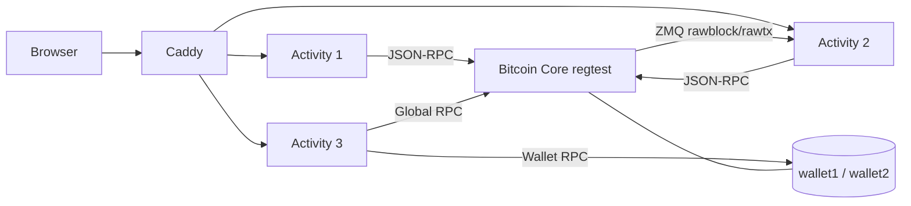

# Arquitetura

[Versao em ingles](../en-US/architecture.md)

CoreCraft e composto por tres microservicos independentes. Cada atividade possui backend FastAPI, frontend React/Vite e cliente JSON-RPC proprio para comunicacao com Bitcoin Core.

## Stack

| Camada | Tecnologia |
|--------|------------|
| Backend | Python 3.12, FastAPI, Uvicorn |
| Frontend | React, Vite, TypeScript |
| Bitcoin Core | JSON-RPC, wallets, `regtest` |
| Eventos | ZMQ na Atividade 2 |
| Orquestracao | Docker Compose, Caddy |

## Servicos

| Atividade | Porta | Responsabilidade |
|-----------|-------|------------------|
| 1 | 8001 | Snapshot da mempool e atraso da blockchain via RPC |
| 2 | 8002 | Eventos `rawblock`/`rawtx` via ZMQ e comparacao com RPC |
| 3 | 8003 | Wallets, PSBT, envio e interpretacao de transacoes |

## Topologia

## Decisoes de Design

- Cada atividade tem seu proprio `rpc_client.py`, tornando o protocolo JSON-RPC explicito e facil de auditar.
- A Atividade 2 usa estado em memoria com `deque`, suficiente para o escopo do projeto.
- A Atividade 3 delega selecao de UTXO, assinatura, finalizacao e broadcast ao Bitcoin Core via PSBT.
- Chamadas globais e chamadas por wallet nao se misturam: operacoes de wallet usam `/wallet/<name>`.
- Falhas de conexao com Bitcoin Core retornam HTTP 503 estruturado, nao HTTP 500 generico.

## Limitacoes Conhecidas

O estado em memoria e reiniciado junto com os processos. Transacoes ja enviadas continuam consultaveis no Bitcoin Core, mas metadados locais temporarios podem ser perdidos.

